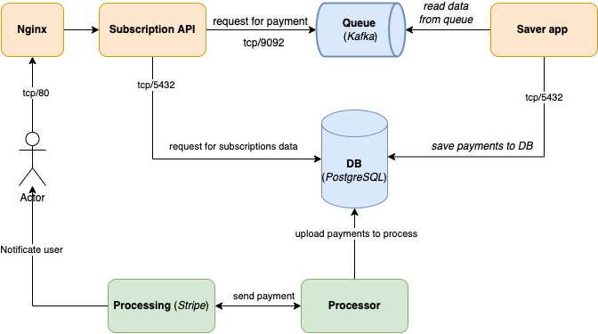
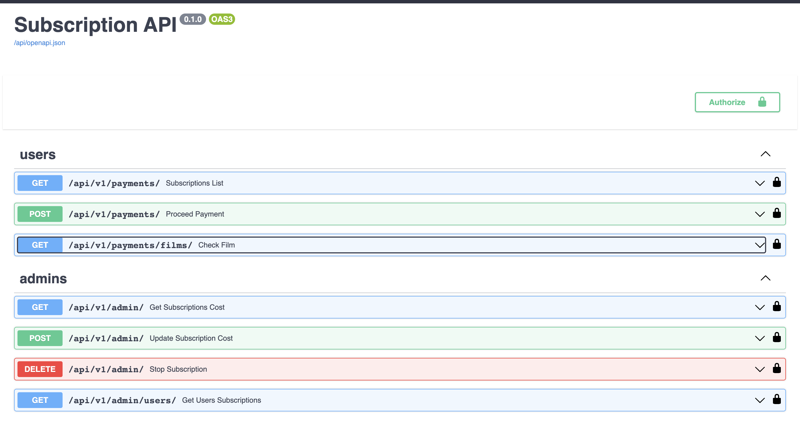

# Проектная работа: диплом

[Репозиторий c дипломной работой](https://github.com/NataliaLaktyushkina/graduate_work)

[Auth service](https://github.com/NataliaLaktyushkina/Auth_sprint_2)

## Запуск проекта
`docker compose up`

**Alembic:**

Необходимо запустить в папке с файлом *"alembic.ini":*

`alembic revision -m "initial"`

`alembic upgrade head`

`alembic revision --autogenerate -m "create_tables"`

`alembic upgrade head`

**Processing statuses:**
- new - платеж создан/отправлен (subscription_app)
- in_processing - платеж в обработке, отправлен в процессинг (processor)
- completed -  отправлено уведомление пользователю (notification app)
- duplicated - пользователь несколько раз отправил запрос на подписку

**Payment statuses:**
- accepted
- error
- decline
- unknown - новый платеж, либо еще в обработке, либо не получен ответ от процессинга

**Переменные окружения:**
- [postgresql](docker/postgres/.env.example)
- [saver](saver/app/core/.env.example)
- [subscription_app](subscription_app/src/core/.env.example)

**Subscription app**:

*http://127.0.0.1:8101/api/openapi*

API - позволяет пользователям:
- оплатить подписку,
- посмотреть список своих подписок.

Администратору:
- Посмотреть список пользователей и их подписок
- Изменить стоимость подписки в БД и в процессинге (stripe)
- Отменить подписку пользователя - на текущий момент этим занимаются адинистраторы,
так как нет четких критириев от бизнеса, в каком случае пользователь может отменить подписку.

Если у пользователя уже есть подписка, то запрос на платеж не отправляется.

Все запросы от пользователя складываются в очередь (kafka).

**Saver**:

Считывает платежи из очереди (kafka).
Складывает все платежи в БД (таблица payments) - processing_status = new.

**Processor:**

Отправляет в процессинг (stripe) последний запрос на платеж от пользователя (processing_status = new).
Данные платеж в БД переходит в processing_status = in_processing.

После ответа от stripe:
Платеж в БД переходит в processing_status = completed.
Задублированные запросы от пользователя переходят в  processing_status = duplicated.
Платеж считается дублем, если:
 - от пользователя уже есть запрос на подписку
 - платеж в processing_status = new

Из stripe отправляем пользователю чек об оплате:

https://dashboard.stripe.com/test/payments

Почту пользователя получаем из Auth service:

*AUTH_SERVICE/v1/user_by_id*

**Notification service:**

Если подписка успешно оплачена (processing_status=completed & payment_status=accepted) отправляем еще одно письмо пользователю.

*NOTIFICATION_SERVICE/adminapi/v1/create_mailing*

Письмо пользователю "Спасибо, что оплатили подписку" с подборкой фильмов.

----
**Kafka:**

List of topics inside a container:

`kafka-topics --bootstrap-server broker:9092 --list`

Send message to topic:

`kafka-console-producer --bootstrap-server broker:9092 --topic payments`

kafka-console-consumer --bootstrap-server broker:9092 --topic payments --from-beginning

Ctrl-D - exit
